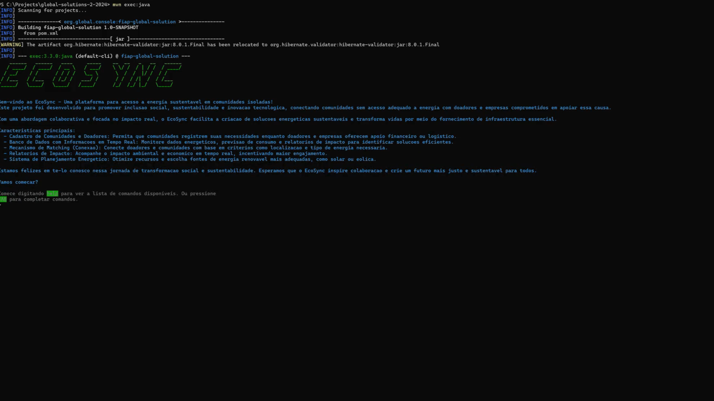

# Fiap Global Solutions 2024/2

Consulte a documentação completa [aqui](https://hemelo.github.io/global-solutions-2-2024/).

A documentação foi criada automaticamente com o auxílio do [mdBook](https://github.com/rust-lang/mdBook), uma biblioteca desenvolvida em Rust.

<h2 id="colab">🤝 Integrantes </h2>

Integrantes que participaram da incrível Global Solution 2 de 2024 da turma de Engenharia de Software (2ESOA)

<table>
  <tr>
    <td align="center">
      <a href="https://github.com/hemelo">
         
        
          <b>Henrique Melo</b>
        
      </a>
    </td>
    <td align="center">
      <a href="https://github.com/giovanamitie">
         
        
          <b>Giovana Mitie</b>
        
      </a>
    </td>
    <td align="center">
      <a href="https://github.com/lucasScardone">
         
        
          <b>Lucas Scardone</b>
        
      </a>
    </td>
  </tr>
</table>

<h2 id="projeto">🚀 Projeto</h2>

Clique na imagem para acessar o vídeo de apresentação do projeto.

<h2 id="pitch">🎤 Pitch</h2>

Clique <a href="https://drive.proton.me/urls/P3S5XJHK70#Y6zLQfW8MCKK">aqui</a> para acessar o pitch do projeto.